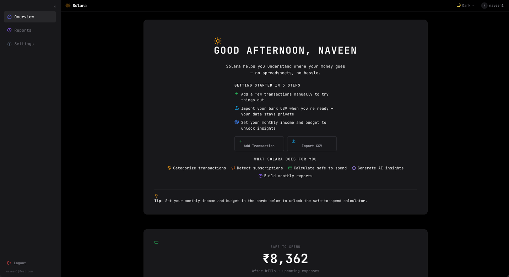
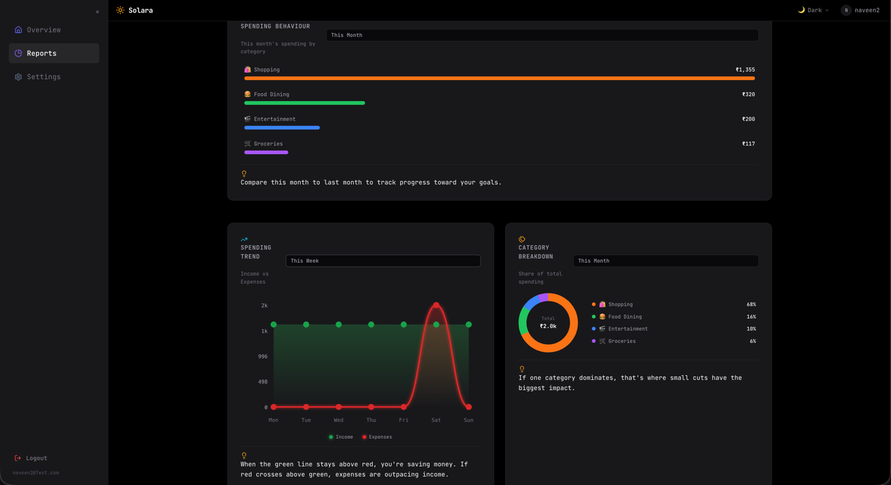
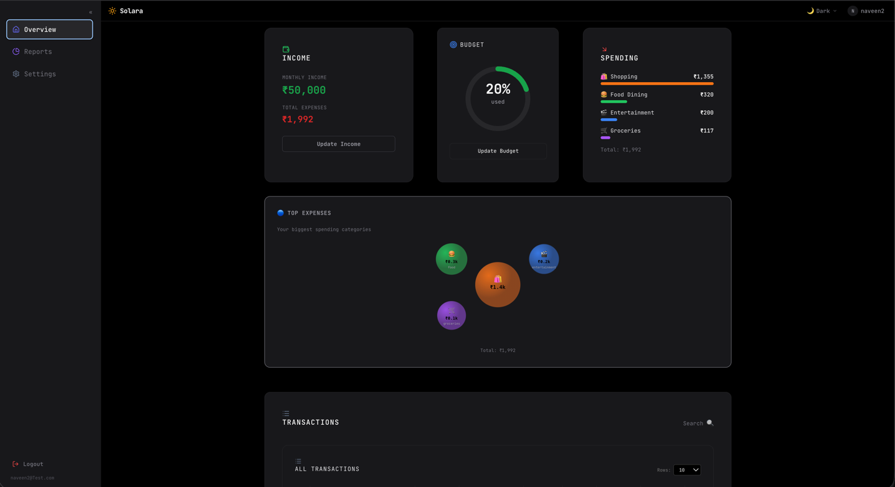

# Solara

[](https://openjdk.org/projects/jdk/21/)
[](https://spring.io/projects/spring-boot)
[](https://spring.io/projects/spring-ai)
[](https://kafka.apache.org/)
[](https://react.dev/)
[](https://www.postgresql.org/)

---

## The Problem

Most people don't have a budgeting problem. They have a **visibility** problem. They know they spent money. They just don't know *where*, *when*, or *whether they can still afford dinner tonight*.

**Jessica** gets paid on the 1st of every month. Rent goes out on the 3rd. By the 15th, she's not sure how much is left for the rest of the month. She exports a CSV each month — 200 rows of "UPI - PAYTM" — and never opens it again.

What she actually wants to know is simple:

- How much can I safely spend this week?
- Which category is eating most of my money — food, transport, or shopping?
- Am I spending more on dining out this month compared to last month?

The answers exist — scattered across bank statements, UPI apps, and credit card portals. But there's no single place that pulls it together, categorizes it automatically, and tells her in plain language what's going on.

**You shouldn't need to hand over your bank password to understand your own spending. You shouldn't need a finance degree to know if you can afford a vacation.**

---

## The Solution

Solara is a **privacy-first finance platform you can run your way — self-hosted or in the cloud.**

- **Self-hosted** — run the full stack with Docker Compose. Every byte stays on your machine.
- **Cloud on AWS** — deploy the same stack in the cloud (a lighter AWS tier with AI-assisted features switched off via `app.ai.enabled` is supported).

Import your bank statements, and Solara uses the open-weight model (qwen3.5:4b) through Ollama to categorize every transaction, tracks your budget and recurring payments, and tells you exactly what's left to spend — no subscription, no SaaS lock-in.






---

## What It Does

### Track & Import

Add transactions manually or bulk-import your bank's CSV. Solara auto-detects the column format — date, amount, description — so you don't have to map fields. Every transaction gets a unique ID and timestamps.

### Categorize with AI

Every transaction is automatically categorized using a local LLM running on Ollama. Solara uses RAG (Retrieval-Augmented Generation) — it looks up similar past transactions via pgvector embeddings, gives the LLM that context, and validates the result confidence. If the AI isn't sure, it flags the transaction for your review. 19 categories out of the box: Food & Dining, Transport, Fuel, Shopping, Clothing, Electronics, Entertainment, Bills & Utilities, Healthcare, Groceries, Pets, Rent, Loan EMI, Salary, Investment, Education, Travel, Other, Uncategorized.

### Know What's Left

Set your monthly income and budget. Solara calculates your **safe to spend** — the real number available after recurring expenses, subscriptions, and what you've already spent. A live calculation that updates every time you add or delete a transaction.

### Report

Weekly, monthly, and yearly reports built from your categorized transactions, each comparing against the previous matching period:

- **Financial snapshot** — your income, expenses, savings, and savings rate for the period, so you always know the bottom line at a glance.
- **Category breakdown** — what each category cost you, sorted by spending, with the percentage change vs. the previous period. See at a glance whether dining out is creeping up month over month.
- **Trend charts** — income vs. expenses plotted day-by-day (weekly report), week-by-week (monthly report), or month-by-month (yearly report).

### Track Recurring Payments

Automatically spot recurring payments from your transactions, or track them explicitly — subscriptions, bills, rent, and EMIs. Every debit is matched against your tracked payments (with a tolerance band for fluctuating bills), the expected next charge rolls forward, and EMIs advance toward paid-off. Status dots and countdowns tell you at a glance which payments are on schedule, late, or exceeded their renewal date.

### AI Overview & Recommendations

Two plain-language surfaces grounded in your own categorized history: the **Overview** narrates what happened with your money this month, the **Recommendations** page tells you what to do next — where to cut spending, review a budget, or clean up uncategorized transactions. Cards refresh daily; hit **Regenerate** (rate-limited) for a fresh take. Disable AI-assisted insights entirely, and everything else — reports, budgets, safe-to-spend — keeps working.

### Stay in Control

Navigate month by month across the Overview and Reports pages. Scroll back to January, compare with March, see how your spending evolved. Pull-to-refresh on mobile. Dark and light themes that respect your system preference.

---

## Privacy, Security & Responsible AI

### Minimal Data, by Design

Solara processes **only transaction data** — merchant description, amount, and date. It does **not** collect account numbers, addresses, or any identity documents. There is nothing to leak that a merchant statement can't tell you, because we never ask for it in the first place. The dataset the AI reasons over is your spending pattern, not your identity.

### Open-Weight Models Run Locally by Default

Categorization uses **Qwen3 4B** (open-weight) and **Nomic Embed Text** embeddings via **Ollama** — open-weight models that run **on your own infrastructure**. No proprietary-model vendor sees your transactions. Cloud model providers are entirely optional and **disabled by default** (commented out in config), so nothing leaves your environment unless you deliberately opt in.

### Responsible AI

- **RAG with validation** — the LLM is grounded in your own transaction history, not a generic guess, and every result passes through a confidence check. Uncertain categories are flagged for your review rather than silently committed.
- **You are always the final decision** — AI is an assist, not an authority. Every categorization can be overridden.

### No Lock-In

Run it on your laptop, a Raspberry Pi, or a full AWS account. The data model, the categorizer, and the UI are the same everywhere — switching deployment is a `docker-compose` command away, not a migration project.

---

## Architecture


- **3 microservices + API gateway** — each service owns its own PostgreSQL database and talks to others primarily through Kafka events; the only direct HTTP call between services is insight-service fetching a user's settings from auth-service over an internal authenticated endpoint.
- **Transactional outbox + CQRS** — transactions publish events through the outbox pattern; the insight service consumes them to build the `categorized_transactions` read model (reports aggregate it directly; monthly-set income & budget live in `budget_settings`).
- **Idempotent consumers** — a `processed_events` table prevents duplicate processing.
- **Resilience4j** — circuit breakers and retry with exponential backoff on LLM calls, dead-letter queues for poison pills.
- **Cache stampede protection** — Redis TTLs use ±20% jitter to prevent synchronized expiry thundering on the database.
- **Virtual threads** — LLM calls block for 10–30 seconds. Virtual threads prevent platform thread saturation.
- **Flyway migrations** — schema versioned and reproducible across every service.
- **Full observability** — OpenTelemetry traces, Prometheus metrics, Grafana dashboards, Loki logs. Optional stack via Docker Compose profile.


---

## Quick Start

```bash
# Prerequisites: Docker Compose, Node.js 20+

git clone https://github.com/stealthyninja86/Solara.git
cd Solara

# Start all backend services
docker-compose up

# In a new terminal — start the frontend
cd frontend
npm install
npm run dev
```

Open [http://localhost:5173](http://localhost:5173), register an account, and you're up.

For the full observability stack, add the profile:

```bash
docker-compose --profile observability up
```

---

## Roadmap

- **Investments section** — a dedicated view for your investments: track SIPs and redemptions over time, see how your portfolio is performing, and keep investing separate from spending at a glance.
